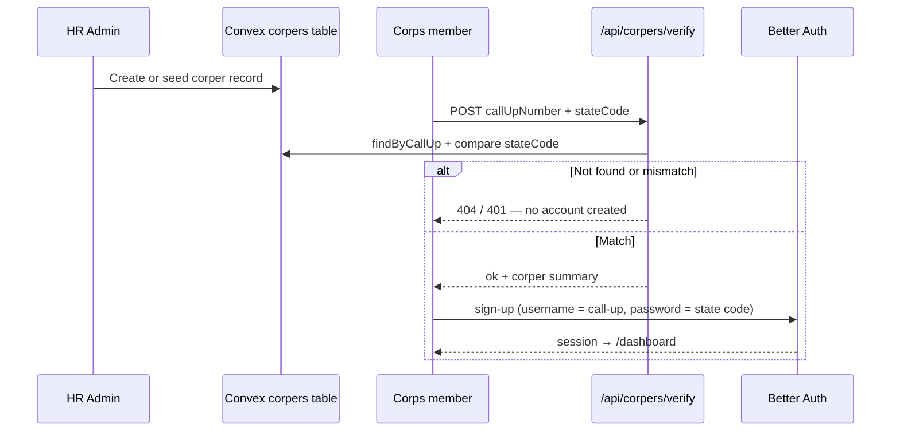
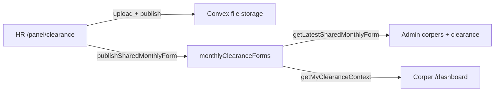

# NYSC Corper Clearance Management System

A web application for **Lead City University** (and similar institutions) to manage **NYSC corps member** records, monthly clearance workflows, and role-based access for **HR admins** and **corpers**.

Built with **Next.js**, **Convex** (realtime backend), and **Better Auth** (email/password for admins, call-up number login for corpers).

---

## What this project does

| Audience | Purpose |
|----------|---------|
| **HR / Admin** | Maintain the corper registry, publish shared monthly forms, assign deployment unit heads, generate bulk clearance letters (DOCX), run reports, and review audit history. |
| **Corper** | Sign in with a call-up number, view clearance status, download the latest HR monthly form, and see deployment unit details. |
| **Integrations** | HTTP APIs to verify corpers, provision accounts, and sync deployment-unit heads from external systems. |

---

## Features implemented

### Authentication and access control

- **Admin signup / login** — Email and password via Better Auth (`/admin-signup`, `/login`).
- **Corper signup / login** — Username is the **call-up number** (e.g. `NYSC/FUW/2025/291316`); validated against the registry where applicable.
- **Role-based routing** — Middleware and route-group layouts redirect admins to `/panel` and corpers to `/dashboard`.
- **Convex-backed sessions** — `ConvexBetterAuthProvider` with server-side token preload in the root layout.

### Admin panel (`/panel`)

| Route | Capability |
|-------|------------|
| `/panel` | Dashboard with links to all admin modules. |
| `/panel/corpers` | Paginated registry with filters (batch, status, deployment unit, call-up search). Create, edit, and delete corpers with **duplicate call-up protection** and **mutation in-flight guards**. Recent **audit log** sidebar. Grouped view by service year. Download link for latest shared monthly form. |
| `/panel/clearance` | Select active corpers; generate **bulk clearance DOCX** (month covered, allowance month, issue date). Upload and publish a **shared monthly form** for all corpers. Manage **deployment unit** names and **head of unit**. |
| `/panel/reports` | Summary counts by status, batch, and deployment unit; export registry and summary **CSV**. |
| `/panel/settings` | Read-only deployment diagnostics (Convex URL, app URL) and registry behaviour notes. |

### Corper portal (`/dashboard`)

- Clearance readiness (latest published form available or not).
- Download link for the current HR monthly form.
- Profile: deployment unit and head of unit.
- Loading skeleton while Convex data resolves.

### Data integrity and security (Convex)

- **Unique call-up numbers** on create and when changing call-up on update.
- **Admin-only** mutations and sensitive queries (`requireAdmin`).
- **Audit log** entries for corper create, update, and delete.
- **CSV seeding** upserts by call-up number; dedupes rows within each batch.

### APIs (`app/api`)

| Endpoint | Role |
|----------|------|
| `/api/auth/[...all]` | Better Auth handler (Convex integration). |
| `/api/auth/provision/corpers` | Bulk provision corper auth accounts from registry data. |
| `/api/corpers/verify` | `POST` — verify call-up number + state code against the registry. |

### UX

- Segment **`loading.tsx`** for admin, corper, and auth routes with a shared **route loading** component (branded spinner card).
- Realtime updates via Convex subscriptions on list and dashboard views.

---

## Walkthrough: registry-first security and shared monthly forms

This section describes the **intended operational flow** from HR admin setup through corper self-service, and how the **shared monthly form** propagates to everyone in realtime.

### Why registry comes before accounts

Corpers cannot create a portal account unless they already exist in the **Convex `corpers` registry** with a matching **call-up number** and **state code**. Signup calls `POST /api/corpers/verify` **before** Better Auth creates a user. That means:

- Random or mistaken call-up numbers are rejected (`404` — not in registry).
- Wrong state codes are rejected (`401` — does not match the record HR entered).
- Only people HR has registered (or imported via CSV seed) can obtain login credentials.

This is the core **security measure**: the admin panel is the source of truth; the auth system is a gate on top of it.



---

### Part 1 — Admin: build and verify the registry

**Step 1 — Create an admin account**

1. Open **`/admin-signup`** and register with email and password.
2. Sign in at **`/login`** → redirected to **`/panel`**.

**Step 2 — Add corpers to the registry (required before any corper can sign up)**

Choose one or both:

| Method | Where | What happens |
|--------|--------|----------------|
| **Manual** | `/panel/corpers` → **Create Corper** | HR enters call-up number, full name, state code, batch, status, deployment unit. Duplicate call-up numbers are blocked in the UI and on the server. |
| **Bulk import** | `pnpm seed:corpers <file.csv>` | Rows upsert by call-up number (see [`scripts/seed/README.md`](scripts/seed/README.md)). |

**Step 3 — Confirm records before inviting corpers**

At **`/panel/corpers`**:

- Use filters (batch, status, deployment unit, call-up search) to find a corper.
- Ensure **state code** and **call-up number** match official NYSC records — these are what corpers must enter at signup.
- Prefer **`ACTIVE`** status for corpers who should sign in and appear in bulk clearance selection.
- Check the **Recent changes** audit sidebar after edits (who created/updated/deleted).

**Optional — Bulk auth provisioning (ops / integration)**

`POST /api/auth/provision/corpers` reads all registry rows and attempts Better Auth sign-up for each (skips or reports existing users). Use only in controlled environments; normal production flow is **self-service signup after verify**.

---

### Part 2 — Corper: verification then account creation

**Step 1 — Corps member opens signup**

Go to **`/corper-signup`** (or the link from your institution’s landing page).

**Step 2 — Enter registry-matching credentials**

| Field | Rule |
|-------|------|
| **Call-up number** | Must match a row in the registry (normalized to uppercase), e.g. `NYSC/FUW/2025/299999`. |
| **State code** | Must **exactly** match `stateCode` on that registry row, e.g. `OY/25C/5999`. |
| Display name / batch | Optional UI fields; verified identity comes from the registry response. |

**Step 3 — Server verification (automatic)**

On submit, the app:

1. **`POST /api/corpers/verify`** — Convex `findByCallUp`; compares `stateCode`.
2. If verification fails → error shown, **no auth user is created**.
3. If verification succeeds → UI shows *Verified: {fullName} ({callUpNumber})*.
4. **`POST /api/auth/sign-up/email`** — Creates Better Auth user with:
   - `username` / `displayUsername` = call-up number (login id),
   - `password` = state code (corpers should change practice per your policy),
   - synthetic email `…@corper.local` for the email plugin.
5. Redirect to **`/dashboard`**.

**Step 4 — Login later**

At **`/login`**, corpers use **call-up number** as username and **state code** as password (same as signup), unless you change credentials in Better Auth.

**Failure messages (security outcomes)**

| Response | Meaning |
|----------|---------|
| Corper not found | HR has not added or seeded this call-up number. |
| State code does not match | Call-up exists but state code wrong — possible typo or fraud attempt. |
| 409 on sign-up | Account already exists → user sent to login. |

---

### Part 3 — Shared monthly form: publish once, visible everywhere

HR publishes **one file per month** for **all** corpers. Corpers do not upload their own monthly form; they download HR’s latest publish.

**Admin publish flow (`/panel/clearance`)**

1. Under **Shared Monthly Form (All Corpers)**:
   - Enter **Month label** (e.g. `May 2026`) — stored as `monthLabel` and normalized `monthKey`.
   - Choose file (`.pdf`, `.doc`, `.docx`).
2. Click **Publish Shared Monthly Form**:
   - Convex `generateMonthlyFormUploadUrl` → file uploaded to Convex storage.
   - Convex `publishSharedMonthlyForm` inserts or **updates** the row for that month (`publishedAt`, `publishedBy`, new `fileId`).
3. Admin sees **Download Latest ({monthLabel})** immediately from `getLatestSharedMonthlyForm`.
4. The same block exists on **`/panel/corpers`** for quick HR access.

**How it appears to corpers (`/dashboard`) — realtime**

Convex query **`getMyClearanceContext`** subscribes to:

- The corper’s registry row (deployment unit, optional head of unit),
- **`monthlyClearanceForms`** ordered by **`publishedAt` descending** (latest wins),
- A fresh **download URL** from Convex storage.

| UI area | When form is published | When not published |
|---------|------------------------|-------------------|
| **Clearance Status** badge | **Ready** (green) | **Not Ready** (grey) |
| Month line | `Current month form: {monthLabel}` | *Not yet published by HR* |
| Last update | `publishedAt` as local date/time | *Not published yet* |
| **Documents** | Link: *Download HR Monthly Form ({monthLabel})* | *No monthly form uploaded yet by HR.* |

Because this uses **Convex subscriptions**, when HR publishes or replaces a form, **open corper dashboards update without refresh** — status, label, and download link switch as soon as the mutation completes.

**Re-publish / correction**

Publishing again with the same month label **updates** the existing `monthKey` row (new file, new `publishedAt`). Everyone immediately sees the corrected document as “latest.”



---

### How this boosts and automates processing

| Before (manual) | With this system |
|-----------------|------------------|
| Emailing forms to each corper | One **publish** → all dashboards get the same file and **Ready** status. |
| Verifying identity by phone or paper | **Automated verify** against registry before any account exists. |
| Chasing who is in the system | Admin registry + **reports CSV** + filters by batch/status/unit. |
| Typing clearance letters one-by-one | **Bulk DOCX** for selected active corpers on `/panel/clearance` (month covered, allowance month, issue date). |
| No audit trail | **corperAuditLogs** on create/update/delete. |

**Typical monthly cycle**

1. HR seeds or updates registry (new batch, status changes).
2. HR publishes shared form for the month → corpers see **Ready** and download.
3. HR selects active corpers and generates bulk clearance DOCX for NYSC submission.
4. HR exports reports for reconciliation.

Together, **registry-first verification** reduces fraudulent signups, and **single publish + realtime Convex** removes repeated distribution work so HR and corpers stay aligned on the same document and status.

---

## Tech stack

- **Framework:** Next.js 16 (App Router)
- **UI:** React 19, Tailwind CSS 4, shadcn/ui, Radix
- **Backend:** [Convex](https://convex.dev) — queries, mutations, file storage
- **Auth:** [Better Auth](https://www.better-auth.com) + `@convex-dev/better-auth`
- **Documents:** `docx` + `file-saver` for clearance letter export

---

## Project structure

```
app/
  (admin)/          # Admin layout + panel routes
  (auth)/           # Login, admin signup, corper signup
  (corper)/         # Corper dashboard
  api/              # Auth, verify, provision
  page.tsx          # Public landing
components/
  route-loading.tsx # Shared loading UI for route segments
  ui/               # shadcn components
convex/
  schema.ts         # corpers, corperAuditLogs, monthlyClearanceForms
  corpers.ts        # Registry, clearance, reports, seed
  corperAudit.ts    # Audit log queries
  auth.ts           # Better Auth + Convex component
scripts/seed/       # CSV → Convex seed script
middleware.ts       # Session + role redirects
```

---

## Prerequisites

- **Node.js** 20+
- **pnpm** (recommended) or npm
- A **Convex** project ([convex.dev](https://convex.dev))
- Environment variables configured (see below)

---

## Getting the project ready

### 1. Install dependencies

```bash
pnpm install
```

### 2. Environment variables

Create **`.env.local`** at the project root (do not commit secrets):

```env
# Required — Convex deployment URL (from `npx convex dev` or dashboard)
NEXT_PUBLIC_CONVEX_URL=https://your-deployment.convex.cloud

# Required — public app URL used for auth redirects (local or production)
NEXT_PUBLIC_APP_URL=http://localhost:3000

# Optional — if using Convex site URL separately
# NEXT_PUBLIC_CONVEX_SITE_URL=

# Optional — server-side scripts / API routes
# CONVEX_URL=  (same as NEXT_PUBLIC_CONVEX_URL if needed server-only)

# Optional — batch size for seed script (default 50)
# SEED_BATCH_SIZE=50
```

Auth-related Convex vars (`NEXT_PUBLIC_APP_URL`, `CONVEX_SITE_URL`, etc.) are documented in `convex/auth.ts` if you deploy to Vercel previews.

### 3. Run Convex and Next.js

In one terminal:

```bash
pnpm exec convex dev
```

In another:

```bash
pnpm dev
```

Open [http://localhost:3000](http://localhost:3000).

### 4. Create an admin account

1. Visit **`/admin-signup`** and register with email and password.
2. Sign in at **`/login`** — you should be redirected to **`/panel`**.

### 5. Seed corper registry (optional)

Import mock or production CSV data into Convex:

```bash
pnpm seed:corpers NYSC_Corper_Registry_MockData10.csv
```

Or:

```bash
pnpm tsx scripts/seed/seed-corpers.ts path/to/registry.csv
```

The script loads `.env.local`, batches rows (default 50 per mutation), and **upserts by call-up number**. See [`scripts/seed/README.md`](scripts/seed/README.md).

Optional flags:

```bash
pnpm tsx scripts/seed/seed-corpers.ts your.csv --force-active
```

### 6. Smoke-test main flows

See **[Walkthrough: registry-first security and shared monthly forms](#walkthrough-registry-first-security-and-shared-monthly-forms)** for the full flow.

- [ ] Admin: create a corper at `/panel/corpers` (duplicate call-up should be blocked).
- [ ] Corper: try signup with **wrong** state code → verify fails, no account.
- [ ] Corper: signup with **matching** call-up + state code → `/dashboard` **Ready** after HR publishes form.
- [ ] Admin: publish a monthly form at `/panel/clearance` → corper dashboard updates (month label + download).
- [ ] Admin: export a report CSV at `/panel/reports`.
- [ ] Admin: check `/panel/settings` for URL diagnostics.

---

## Available scripts

| Command | Description |
|---------|-------------|
| `pnpm dev` | Start Next.js dev server |
| `pnpm build` | Production build |
| `pnpm start` | Start production server |
| `pnpm lint` | Run ESLint |
| `pnpm seed:corpers <csv>` | Seed corpers from CSV via Convex |
| `pnpm exec convex dev` | Run Convex dev deployment + codegen |

---

## Convex data model (summary)

| Table | Purpose |
|-------|---------|
| `corpers` | Registry: call-up, state code, name, batch, status, deployment unit |
| `corperAuditLogs` | Who changed what and when |
| `monthlyClearanceForms` | Shared HR form file per month (Convex storage) |

Indexes support filtering by call-up, batch, status, deployment unit, and compound filters for admin list views.

---

## Deployment notes

- Set **`NEXT_PUBLIC_CONVEX_URL`** and **`NEXT_PUBLIC_APP_URL`** (or Vercel URL) in the hosting provider.
- Run **`pnpm exec convex deploy`** for production Convex functions.
- For Vercel previews, auth supports `*.vercel.app` when configured in `convex/auth.ts` (see `AUTH_TRUST_VERCEL_APP` / trusted origins).
- Prefer **paginated** admin lists over loading entire tables at scale; see performance notes in code for `listByServiceYear` / `reportSummary` limits (up to 5000 rows).

---

## Related documentation

- [`docs/PROJECT-PROPOSAL.md`](docs/PROJECT-PROPOSAL.md) — **Non-technical proposal** for HR, management, and stakeholders (navigation, security, DOCX export, audit logs, business case)
- [`scripts/seed/README.md`](scripts/seed/README.md) — CSV format and seeding
- [`AGENTS.md`](AGENTS.md) / [`CLAUDE.md`](CLAUDE.md) — agent and Convex guidelines for contributors
- [Convex docs](https://docs.convex.dev) — queries, mutations, and deployment

---

## License

Private / institutional use unless otherwise specified by the repository owner.
