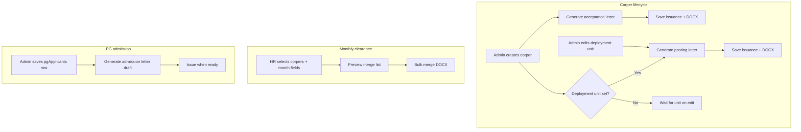

# Letter automation & remote editing — plan

**Project:** NYSC Corper Clearance Management System (Lead City University)  
**Date:** 28 May 2026  
**Status:** Decisions confirmed — ready to start Milestone 1  
**Reference materials:** Project owner’s sample letters (acceptance, posting, monthly clearance, PG admission) and CamScanner PDF — used as **layout targets for this build**, not external HR handoffs

---

## 1. Executive summary

Today, monthly clearance letters are built in the browser with the `docx` library (`app/(admin)/panel/clearance/page.tsx`). Layout, wording, and signatory blocks live in **TypeScript**, not in Word. HR cannot change the template without a developer, and there is **no draft/review step** before printing on official letterhead.

The goal is to turn the **corper registry (Convex)** into the single source of truth for **four document types**, each issued at the right lifecycle moment, with templates HR can **edit remotely** (in Word) and optional **preview / tweak** of merge fields before print.

| Letter type | When it should be issued | Primary audience |
|-------------|--------------------------|------------------|
| **Acceptance for primary assignment** | When a corper is **created** (or first activated) | NYSC State Director |
| **Posting** | When a **deployment unit** is set or changed | The corper |
| **Monthly clearance** | Each clearance cycle (existing flow) | NYSC State Coordinator |
| **Postgraduate admission** | When PG applicant data is approved (separate registry) | Admitted student |

This document summarises requirements from the sample letters, compares approaches, proposes data model and architecture, and lists **execution milestones** for sign-off.

### Confirmed product decisions (28 May 2026)

| Topic | Decision |
|-------|----------|
| **Draft vs issue** | All generated letters start as **DRAFT**. HR reviews, may download/edit locally, then clicks **Issue** to mark FINAL (reference locked; suitable for print on letterhead). |
| **Re-posting** | **New posting letter** every time `deploymentUnit` changes (previous posting issuance remains in history). |
| **PG admission** | **Same project** — include for **showcase/demo** (Milestone 6), not a separate app. |
| **Letterhead** | **Pre-printed institutional letterhead only.** Do not embed logo/header in templates. Keep **existing top margins** (e.g. clearance `top: 3500` twips) so body text aligns on school stationery. |

**v1 scope:** Milestones **1–6** (infrastructure through PG showcase).

---

## 2. Current state

### What works today

- **Corper registry** (`corpers` table): `fullName`, `callUpNumber`, `stateCode`, `batch`, `deploymentUnit`, `status`, optional `headOfUnit`.
- **Bulk monthly clearance DOCX**: multi-page document, one letter per selected corper, top margin reserved for pre-printed letterhead.
- **Shared monthly form** upload (PDF/DOCX) for corpers — pattern already used for “HR publishes file, everyone downloads.”

### Limitations (why change)

| Limitation | Impact |
|------------|--------|
| Template in code (`Paragraph`, `TextRun`) | Wording/margin changes need a developer and redeploy |
| No stored letter instances | Cannot track “issued”, reprint, or audit which version was sent |
| No reference number sequence | Samples use refs like `LCU/REG/CORPS/26/003` — not generated today |
| Acceptance / posting not automated | HR still types these from scratch in Word |
| PG admission is out of scope | Different applicant fields; same *pattern*, different registry |
| “Remote edit before print” | Only option today: download DOCX and edit locally *after* generation — no central draft |

---

## 3. Letter templates (from samples)

### 3.1 Acceptance for primary assignment

**Trigger:** Corper record **created** (and optionally on status → ACTIVE).

**Recipient block (fixed):**

- The State Director  
- National Youth Service Corps  
- Ibadan, Oyo State, Nigeria  

**Subject:** Acceptance for Primary Assignment (underlined)

**Body (merge fields):**

> This is to inform you that **{fullName}** with NYSC Call up No. **{callUpNumber}** and State Code No. **{stateCode}** has been accepted to perform his primary assignment with Lead City University, Ibadan.

**Header metadata:**

| Field | Example | Source |
|-------|---------|--------|
| Reference | `LCU/REG/CORPS/26/003` | Auto sequence per year/batch |
| Date | `January 12, 2026` | Issue date (configurable) |

**Signatory (configurable template):**

- A. O. Ayanjompe (Mrs.) — Deputy Registrar, HR (Admin/Tech. Est.) — For: Registrar

---

### 3.2 Posting letter

**Trigger:** `deploymentUnit` **set or updated** on create/edit (only when unit is non-empty and changed).

**Recipient:** Mr./Ms. {salutationName} (from `fullName`)

**Subject:** Posting (bold)

**Body (merge fields):**

- Posting department: `{deploymentUnit}` (e.g. Admissions Department)  
- Effective date: `{effectiveDate}` (default: issue date)  
- Reporting officer: `{reportingOfficer}` — from `corpers.headOfUnit` or template default (e.g. “Deputy Registrar, Admissions office”)

**Header metadata:**

| Field | Example |
|-------|---------|
| Reference | `LCU/REG/GN/26` |
| Date | `January 13, 2026` |
| From | Registrar |

---

### 3.3 Monthly clearance (existing)

**Trigger:** HR bulk generation (monthly), optionally later tied to per-month **approval** records.

**Recipient:** The State Coordinator, N.Y.S.C, Oyo State, Nigeria  

**Subject:** Monthly Clearance (italic, underlined)

**Body:** Certifies satisfactory work for `{monthCovered}` and allowance for `{allowanceMonth}` — corper name, state code, call-up from registry.

**Note:** Top margin (~3500 twips) assumes **pre-printed letterhead**. Same assumption for other letters unless full letterhead is embedded in the template file.

---

### 3.4 Postgraduate admission letter

**Trigger:** Admin creates or updates a row in **`pgApplicants`** (separate Convex table — **not** `corpers`). Letter generation (Milestone 6) reads this registry; conditions 1–5 and boilerplate stay in the DOCX template.

**Recipient block — all from `pgApplicants` (database):**

| Convex field | Example (sample letter) | Template placeholder |
|--------------|---------------------------|----------------------|
| `fullName` | EZE Ernest Chibueze | `{fullName}` |
| `addressLine1` | 40 Temidire Odeku Street, Off Liberty Academy Road | `{addressLine1}` |
| `addressLine2` | (optional second line) | `{addressLine2}` |
| `city` | Ibadan | `{city}` |
| `state` | Oyo State | `{state}` |
| `country` | Nigeria | `{country}` |
| `formattedAddress` | Built in merge layer | `{formattedAddress}` |
| `salutationTitle` + `salutationName` | Mr. + Eze → Dear Mr. Eze, | `{salutationLine}` |

**Academic block — all from `pgApplicants`:**

| Convex field | Example | Template placeholder |
|--------------|---------|----------------------|
| `faculty` | Faculty of Engineering | `{faculty}` |
| `department` | Department of Electrical Engineering | `{department}` |
| `degreeType` | Master of Science (M.Sc) | `{degreeType}` |
| `programme` | Electrical Engineering | `{programme}` |
| `programmeOption` | Control Engineering | `{programmeOption}` |
| `programmeFull` | Electrical Engineering (Control Engineering) | `{programmeFull}` |
| `academicSession` | 2025/2026 | `{academicSession}` |
| `sessionStartDate` | 2025-09-29 (formatted at merge) | `{sessionStartDate}` |

**Letter metadata (at issuance, not on applicant row):**

| Field | Example |
|-------|---------|
| Reference | `LCU/PG/ADM/2025/2026/0013927` |
| Issue date | `29th January, 2026` |

**Process:** Applicant details are **entered once in admin** (like corpers). Merge fills the address and academic paragraphs; long legal text remains in the template. **Draft → Issue** before print on pre-printed letterhead (same margins as NYSC letters).

**Code (implemented):** `convex/schema.ts` (`pgApplicants`, `pgApplicantAuditLogs`), `convex/pgApplicants.ts`, `convex/pgApplicantAudit.ts`, `lib/schemas/pgApplicant.ts`, `lib/letters/pgMergeFields.ts`.

---

## 4. Recommended approach: template files + merge (not code paragraphs)

### Why not keep building letters in `page.tsx`?

Programmatic `docx` is fine for a **frozen** prototype. It does **not** support:

- HR editing wording in Word without a deploy  
- Multiple letter layouts (acceptance vs posting vs PG) maintained by Registry  
- “Edit remotely before print” in a practical sense  

### Recommended pattern: **DOCX templates with placeholders**

1. HR/Registry maintains official `.docx` files (matching CamScanner / PDF layouts) with placeholders, e.g.  
   `{fullName}`, `{callUpNumber}`, `{stateCode}`, `{deploymentUnit}`, `{issueDate}`, `{referenceNo}`, `{reportingOfficer}`.
2. App stores template files in **Convex file storage** (versioned: “Acceptance v3 – May 2026”).
3. On trigger (create corper, update unit, bulk clearance, PG admit), server or client runs **docxtemplater** (or similar) → merged DOCX.
4. Optional **preview step** in admin UI: show merge field values, allow override of issue date / reference / one-off paragraph edits, then **Generate & download** or **Save to letter record**.

### “Remote edit before print” — practical options

| Option | Effort | Fit |
|--------|--------|-----|
| **A. Edit the template .docx** (upload new version to admin) | Low | Best default — HR uses Word on desktop; no code change |
| **B. Preview + field overrides** in web UI before merge | Medium | Tweaks date, ref, reporting officer without opening Word |
| **C. Save merged DOCX as DRAFT in storage; HR downloads, edits, re-uploads FINAL** | Medium | True last-mile edits per corper |
| **D. OnlyOffice / Word Online embedded** | High | Full in-browser Word; likely overkill for v1 |

**Recommendation for v1:** **A + B** (template upload + preview overrides). Add **C** for posting/acceptance if Registry insists on per-letter tweaks.

### Reference numbers

Add a small **sequence service** in Convex, e.g.:

- `LCU/REG/CORPS/{YY}/{seq}` — acceptance  
- `LCU/REG/GN/{seq}` — posting  
- `LCU/PG/ADM/{session}/{seq}` — PG admission  

Store issued `referenceNo` on each `letterIssuance` row (immutable once FINAL).

---

## 5. Proposed data model (Convex)

### 5.1 `letterTemplates`

| Field | Purpose |
|-------|---------|
| `type` | `acceptance` \| `posting` \| `clearance` \| `pg_admission` |
| `name` | Display name |
| `fileId` | Convex storage → `.docx` template |
| `version` | Integer or label |
| `isActive` | Only one active per type |
| `defaultSignatory` | Optional JSON (name, title, “For: Registrar”) |
| `uploadedAt`, `uploadedBy` | Audit |

### 5.2 `letterIssuances` (one row per generated letter)

| Field | Purpose |
|-------|---------|
| `templateId`, `templateVersion` | What was used |
| `subjectType` | `corper` \| `pgApplicant` |
| `subjectId` | `Id<"corpers">` or `Id<"pgApplicants">` |
| `letterType` | Same enum as template |
| `referenceNo`, `issueDate` | Issued metadata |
| `mergeSnapshot` | JSON of all merge values at generation time |
| `status` | `draft` \| `final` \| `void` |
| `fileId` | Generated DOCX in storage (optional until generated) |
| `trigger` | `corper_created` \| `deployment_updated` \| `bulk_clearance` \| `manual` |
| `createdAt`, `createdBy` | Audit |

### 5.3 `pgApplicants` ✅ (implemented — separate from corpers)

| Field | Type | Notes |
|-------|------|--------|
| `fullName` | string | As on admission letter |
| `fullNameSearch` | string | Uppercase copy for admin search index |
| `addressLine1`, `addressLine2?` | string | Postal block |
| `city`, `state`, `country` | string | Default country `Nigeria` on create |
| `salutationTitle?`, `salutationName?` | string | e.g. Mr. + Eze |
| `faculty`, `department` | string | Faculty / department lines |
| `degreeType` | string | e.g. Master of Science (M.Sc) |
| `programme`, `programmeOption?` | string | Programme + option |
| `academicSession` | string | e.g. 2025/2026 |
| `sessionStartDate` | string | ISO date string; formatted at merge |
| `status` | string | `PENDING` \| `ADMITTED` \| `WITHDRAWN` |
| `createdAt` | number | ms timestamp |

**Audit:** `pgApplicantAuditLogs` (mirror `corperAuditLogs`).

**Not stored on applicant:** reference number, issue date, generated DOCX — those belong on `letterIssuances` (Milestone 1).

### 5.4 `referenceSequences`

Per `letterType` + year/session → last number (atomic increment in mutation).

### 5.5 Extend `corpers` (optional)

| Field | Purpose |
|-------|---------|
| `acceptanceLetterId` | Latest final acceptance issuance |
| `postingLetterId` | Latest final posting issuance |
| `postingEffectiveDate` | Override for posting body |

---

## 6. Workflows (target behaviour)

### Corper create (`corpers.create`)

1. Insert corper.  
2. If active template for `acceptance` exists → create `letterIssuance` (**DRAFT**) → merge DOCX → store file.  
3. If `deploymentUnit` non-empty → same for `posting` (**DRAFT**).  
4. HR opens letter queue → preview/download → clicks **Issue** → status `final`, reference number committed.

### Corper update (`corpers.update`)

1. If `deploymentUnit` changed (and not empty) → new **posting** issuance (**DRAFT**, new reference sequence); prior postings stay in history (final or void per policy).

### Admin UI

- **Letters** section: list issuances by type/status; download DOCX; reprint.  
- **Templates**: upload/download active template per type.  
- **Bulk clearance**: migrate existing page to template merge (keep bulk multi-page behaviour).

---

## 7. Migration from current clearance code

| Step | Action |
|------|--------|
| 1 | Reproduce current clearance letter in a `.docx` template with placeholders (match margins for letterhead). |
| 2 | Replace `generateBulkDocx()` body with docxtemplater + loop (or generate per page and combine). |
| 3 | Keep UI controls: month covered, allowance month, issue date, corper selection. |
| 4 | Deprecate inline `Paragraph` / `TextRun` builders once parity verified. |

---

## 8. Open items (non-blocking)

| Topic | Status |
|-------|--------|
| PDF output | **Deferred** — DOCX only for v1 (print on letterhead). |
| DOCX layout sources | Built from **project owner’s sample letters** (same as NYSC flows); admin uploads merged templates in Milestone 1 UI. |
| PG admin UI | Registry CRUD page (`/panel/pg-applicants`) — Milestone 6 showcase (schema ready now). |

---

## 9. Execution milestones

Approve phases before development. Each phase is shippable on its own.

### Milestone 0 — Product decisions ✅

- [x] Draft until **Issue**; new posting on every unit change; PG in same project; pre-printed letterhead margins.  
- [x] Sample letters = **project layout reference** (not external admin document gate).  
- [x] **`pgApplicants` schema** — separate from `corpers` (see §5.3).

---

### Milestone 1 — Template infrastructure ✅

**Convex:**

- [x] `letterTemplates`, `letterIssuances`, `referenceSequences`  
- [x] `pgApplicants`, `pgApplicantAuditLogs`  

**Backend / lib:**

- [x] `convex/letters.ts` — template upload, active template, reference reserve, `issueIssuance`  
- [x] `lib/letters/merge.ts` — docxtemplater merge  
- [x] `lib/letters/buildMergeData.ts`, `corperMergeFields.ts`, `pgMergeFields.ts`  

**Admin UI:**

- [x] `/panel/letters/templates` — upload / set active / test merge download  

**Deliverable:** Upload a `.docx` template (built from your samples), run **test merge**, download result. Pre-printed letterhead margins preserved in templates (no embedded logo).

**Estimated effort:** 3–5 dev days

---

### Milestone 2 — Acceptance letter on corper create ✅

- [x] Hook `corpers.create` (and optional seed import path) → acceptance issuance.  
- [x] Reference sequence `LCU/REG/CORPS/...`.  
- [x] Admin: view/download acceptance letter per corper on registry row or detail drawer.  
- [x] Preview overrides: issue date, reference (optional).

**Deliverable:** Creating a corper produces **draft** acceptance DOCX; HR **Issue** action finalises it.

**Estimated effort:** 2–4 dev days

---

### Milestone 3 — Posting letter on deployment assignment ✅

- [x] Hook create (if unit present) + `corpers.update` when `deploymentUnit` changes.  
- [x] Pull `headOfUnit` from `corpers` for `{reportingOfficer}`.  
- [x] Reference sequence `LCU/REG/GN/...`.  
- [x] Admin: posting letter history per corper.

**Deliverable:** Each deployment change generates a new **draft** posting letter; **Issue** before print.

**Estimated effort:** 2–4 dev days

---

### Milestone 4 — Refactor monthly clearance to templates ✅

- [x] Clearance `.docx` template with placeholders (`{#corpers}` loop).  
- [x] Replace inline `docx` builder in `clearance/page.tsx` with merge + bulk pagination.  
- [ ] Optional: save each bulk run as issuances (audit) or one bulk file record.

**Deliverable:** Same bulk output as today; HR can edit template without deploy.

**Estimated effort:** 2–3 dev days

---

### Milestone 5 — Preview & remote-edit polish

- [ ] Pre-merge preview table (all selected corpers + field overrides).  
- [ ] Optional DRAFT → download → re-upload FINAL for edge cases.  
- [ ] Letter issuance list filters (type, batch, date range); reprint.

**Deliverable:** “Edit remotely before print” workflow HR can follow without developer.

**Estimated effort:** 3–5 dev days

---

### Milestone 6 — Postgraduate admission module (showcase)

- [x] `pgApplicants` + audit tables and Convex API (`convex/pgApplicants.ts`).  
- [ ] `/panel/pg-applicants` admin CRUD (same patterns as `/panel/corpers`).  
- [ ] PG admission template + merge; reference `LCU/PG/ADM/...`.  
- [ ] Draft → **Issue** on create/update (status → `ADMITTED` optional trigger).  
- [ ] Bulk generate for selected applicants (demo walkthrough).

**Deliverable:** Enter applicant (name, address, faculty, degree, programme, session) → generate admission letter from DB fields → Issue → print.

**Estimated effort:** 3–5 dev days (schema already done)

---

### Milestone 7 — Optional enhancements

- [ ] PDF export (e.g. libreoffice-convert or cloud function).  
- [ ] Email letter to corper / applicant.  
- [ ] Link clearance issuances to monthly approval records.  
- [ ] API webhook for external admissions system.

---

## 10. Summary answer: “Is there a better way?”

**Yes.** Move from **code-built DOCX** to **uploaded Word templates + database-driven merge**, with **letter issuance records** and optional **preview/overrides**. That matches how Registry already works (Word + letterhead), enables remote template edits without redeploying the app, and supports acceptance → posting → clearance → PG admission on one platform.

---

## 11. Next step

**Confirmed v1:** Milestones **1 → 6** with draft/issue workflow, re-posting on every unit change, pre-printed letterhead margins only, PG registry separate from corpers.

**Implementation order:** Milestone 1 (letter tables + merge + template UI) → 2 → 3 → 4 → 5 → 6 (PG admin UI + admission letters).

**Done:** Milestones 1–4 (template infra, acceptance, posting, bulk clearance merge).

**Next:** Milestone 5 — preview & remote-edit polish.

**References:** Acceptance uses corper `registrySerial` per service year (`LCU/REG/CORPS/26/002`). Posting uses global posting letter `registrySerial` (`LCU/REG/GN/002`). Draft merges leave `{referenceNo}` empty; optional preview override on issue.
